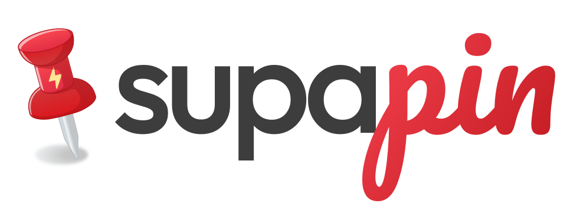

# SubmitDock

> **Spend your tokens, not your money and time.**

Submit your product to web directories, and prove which ones actually linked back.

Runs entirely on your machine, next to your coding agent. SQLite, no account, no
server, no API in the middle.

Built by [@camposped](https://x.com/camposped).

## The idea

Getting listed in directories is how a new product earns backlinks in volume. Paying
someone to do it gets you a number: "submitted to 300 sites". That number is not the
thing you wanted. The thing you wanted is **links that exist and pass authority**, and
nobody proves that part.

SubmitDock is built around proving it. `verify.ts` fetches every listing page you
recorded, checks whether a real `<a>` points at your product, and reports whether it is
dofollow or nofollow. That is the number on the dashboard.

## What it is not

It does not submit anything by itself. The work is done by a **coding agent** (Claude
Code, Codex, whatever you run) driving **Chrome** through a browser extension. This app
is the dashboard beside them: it holds the catalog and your answers, shows what the
agent is doing live, and hands you the forms it cannot finish alone.

## Getting started

```bash
npm install
npm run db:migrate     # create data/submitdock.db
npm run import         # load the directory catalog that ships with this repo
npm run dev            # http://localhost:3007
```

Add your product from the switcher at the top of the sidebar, fill in the Product Kit,
then point your agent at the repo. `AGENTS.md` is its instruction sheet.

Or skip all of it and paste the setup prompt from
[submitdock.com](https://submitdock.com/#start) at your agent instead. It does the four
commands above and then asks you what it needs for the kit, which is the part a form
does badly anyway.

## What comes in the box

`data/catalog.export.json` holds 200+ directories from a crawl: reachability, submit
URLs, and flags for captcha, account and fee.

Authority is **Semrush Authority Score**, 0 to 100, written by `npm run authority` from
`data/authority.semrush.json`. It replaced Ahrefs Domain Rating, and the two are not
interchangeable: the same domain reads 89 as DR and 54 as AS, and the gap is not a
constant. One column, one source, so a sort compares like with like. Null means Semrush
has no data for that domain, which is not the same as scoring it zero.

Where a `submitUrl` is null it means "not found yet", not "has no form": the crawler
reads static HTML and plenty of these sites are SPAs.

### More than one list

Nobody agrees on where to submit, so load several and pick which one to work:

```bash
npm run import -- lists/awesome-saas.json \
  --catalog awesome-saas --name "Awesome SaaS" --url https://github.com/someone/list
```

A catalog is membership, not a copy. A domain two lists share keeps one row of facts,
so an overlapping import costs almost nothing and the authority score you already have
is never blanked by a list that only carried domains.

The two that ship are `catalog-1` and `catalog-2`. Deliberately plain: whose list a
catalog came from is that curator's business, not something to bake into a public slug.

Your own notes on a directory stay on your machine. `directories.notes` is never
exported, so an imported list's private annotations cannot ride along into a snapshot
you commit. What is worth publishing about a directory goes in its `playbook`.

## The model

| | |
|---|---|
| `catalogs` | the lists you have loaded, one row per curator's list |
| `directories` | every domain any list names, one row each, facts shared |
| `products` | the kit of answers for each of your products |
| `submissions` | the crossing of the two, with the outcome of each send |
| `events` | what already happened |
| `runs` | what the agent is doing right now |

The catalog is the asset. The robot is disposable, the list is not, and it serves your
second product without being rebuilt.

## Scripts

| command | what it does |
|---|---|
| `npm run dev` | the app, on port 3007 |
| `npm run db:migrate` | apply migrations to `data/submitdock.db` |
| `npm run import [file]` | load a snapshot; `--catalog slug` files it as a named list |
| `npm run export` | write the catalog back to `data/catalog.export.json` |
| `npm run submit -- begin\|done` | record one attempt: the clock, the screenshot, the playbook |
| `npm run verify [slug]` | check every listing page for a real backlink |
| `npm run agent -- start "..."` | how the agent reports what it is doing |
| `npm run seed` | rebuild the catalog from the crawl, needs `CRAWL_SEED` |
| `npm run authority` | write Semrush Authority Score onto the catalog |
| `npm test` | the seed and verify suites |

`probe.ts` and `triage.ts` are named in the scripts but not written yet.

### verify.ts

The one worth reading. For every submission with a `listingUrl` it fetches the page and
checks whether a real link to your product is on it. It knows that:

- `rel="ugc"` and `rel="sponsored"` are nofollow, not wins
- a page level `<meta name="robots" content="nofollow">` downgrades every link on it
- `https://www.product.com/?ref=x` and `product.com` are the same target
- a page that will not load leaves the previous verdict alone rather than downgrading it

It also writes back what a directory hands out, so "this one gives dofollow" becomes
catalog knowledge your next product inherits.

### The catalog gets smarter every campaign

Each directory carries a `playbook`: what the agent learned about submitting
there, written for whoever submits next. Which URL is the real form, which
field has an unmarked length limit, whether a captcha passes on its own,
whether `verify.ts` can even reach the domain.

It is about the site and never about your product, and it ships in the
committed snapshot. So a clone does not start from zero, and every campaign
anyone runs makes the list worth more.

## The catalog is portable, the database is not

A `.db` file does not diff in git, and the catalog is exactly the part worth carrying
between machines and products. So `data/catalog.export.json` is committed and the
database is not. A re-export with no changes produces a byte identical file, so running
it never shows up as a spurious commit.

## Contributing

Adding directories to the catalog is the most useful thing you can send: export, commit
the diff, open a PR. `CLAUDE.md` covers how the code is put together.

## Brought to you by

This is free and MIT licensed. These pay for the time that goes into it.

<!-- Two variants per logo where the ink is fixed: GitHub flips the page theme
     under the reader, and a black wordmark disappears on the dark one. -->

| | |
|---|---|
| <a href="https://templated.io"></a> | Images from templates, over an API. |
| <a href="https://supapin.com"><picture><source media="(prefers-color-scheme: dark)" srcset="public/sponsors/supapin-dark.svg"></picture></a> | Turns a website into Pinterest pins, designed and scheduled. |
| <a href="https://kometrics.com"><picture><source media="(prefers-color-scheme: dark)" srcset="public/sponsors/kometrics-dark.svg"></picture></a> | Subscription analytics with a ledger you can audit. |

MIT licensed. Built by [@camposped](https://x.com/camposped).
